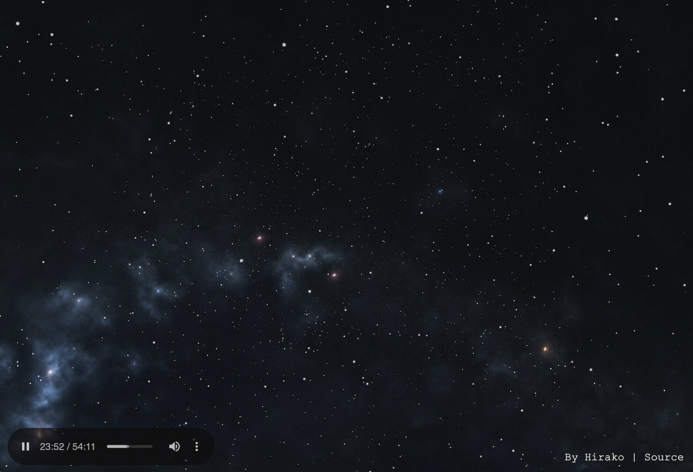

<!-- PROJECT SHIELDS -->

[![Uptime][uptime-shield]][uptime-url]
[![Contributors][contributors-shield]][contributors-url]
[![Forks][forks-shield]][forks-url]
[![Stargazers][stars-shield]][stars-url]
[![Issues][issues-shield]][issues-url]
[![repo-size][repo-size-shield]][repo-size-url]
[![license][license-shield]][license-url]

<!-- PROJECT LOGO -->
<br />
<div align="center">

  <h3 align="center">Personal Website</h3>

   <a href="https://stranger-reality.mtassoumt.uk">
      
   </a>

  <p align="center">
    A static web audio viz
    <br />
    <a href="https://stranger-reality.mtassoumt.uk"><strong>See live »</strong></a>
    <br />
    <br />
    <a href="https://github.com/hirako2000/stranger-reality/issues">Report Bug</a>
    ::
    <a href="https://github.com/hirako2000/stranger-reality/issues">Request Feature</a>
  </p>
</div>

<p align="center">
OK, DOkey
</p>

<!-- TABLE OF CONTENTS -->
<details>
  <summary>Table of Contents</summary>
      <ol>
         <li>
         <a href="#about">About</a>
         <ul>
            <li><a href="#built-with">Built With</a></li>
         </ul>
         </li>
         <li>
         <a href="#getting-started">Getting Started</a>
         <ul>
            <li><a href="#prerequisites">Prerequisites</a></li>
            <li><a href="#repo">Repo</a></li>
            <li><a href="#develop">Develop</a></li>
            <li><a href="#build">Build</a></li>
            <li><a href="#deploy">deploy</a></li>
         </ul>
         </li>
         <li><a href="#asset-size-stats">Assets stats</a></li>
         <li><a href="#codebase">Codebase</a></li>
         <li><a href="#roadmap">Roadmap</a></li>
         <li><a href="#contributing">Contributing</a></li>
         <li><a href="#license">License</a></li>
         <li><a href="#acknowledgments">Acknowledgments</a></li>
      </ol>
</details>

<hr/>

**TL;DR**

## 🛠 Installation & Set Up

1. Install nodejs/npm, or skip to 2.

2. Install and use the correct version of Node using [nvm](https://github.com/nvm-sh/nvm)

   ```sh
   nvm install
   ```

3. Install dependencies

   ```sh
   npm install
   ```

4. Start the development server

   ```sh
   npm run dev
   ```

## 🚀 Building and Running for Production

1. Generate a full static production build

   ```sh
   npm run build
   ```

<hr/>

<!-- ABOUT THE PROJECT -->

## About

A person who thinks all the time has nothing to think about except thoughts. So he loses touch with reality and lives in a world of illusions. By “thoughts” I mean specifically chatter in the skull: perpetual and compulsive repetition of words, of reckoning and calculating. I’m not saying that thinking is bad—like everything else, it’s useful in moderation: a good servant but a bad master. And all so-called civilized peoples have increasingly become crazy and self-destructive because, through excessive thinking, they have lost touch with reality. That’s to say: we confuse signs, words, numbers, symbols, and ideas with the real world. Most of us would have rather money than tangible wealth. And a great occasion is somehow spoiled for us unless photographed, and to read about it the next day in the newspaper is oddly more fun for us than the original event.

<div align="center">

   <a href="https://stranger-reality.mtassoumt.uk">
      
   </a>
</div>

- not in control of the data and layout
- could get banned and everything is lost
- HTML5 from source allows fine grained control over the content

Nothing is perfect.

<p align="right">(<a href="#readme-top">back to top</a>)</p>

### Built With

- [node.js](https://nodejs.org/) - of course
- [vite](https://https://vitejs.dev/) - it helps
- [threejs](https://threejs.org/) - helps even more

### Also using

- [biome](https://biomejs.dev/) - to check the code isn't too malformed you know.

<hr/>

<!-- GETTING STARTED -->

## Getting Started

### Prerequisites

- you need [Git](https://git-scm.com/) installed
- and [nodejs](https://nodejs.org/) of course

### Repo

```bash
$ git clone https://github.com/hirako2000/stranger-reality.git
```

Navigate to the repo root's folder then install dependencies

```bash
$ cd ./stranger-reality && npm install
```

### Develop

```bash
$ npm run dev  #browser will refresh on code change
```

### Build

This command will build everything for production deployment:

```bash
$ npm run build
```

It generates the files for the entire page.

### Deploy

To host the assets, the build placed them all into the `src/dist` folder. this deploy script uploads them 'somewhere':

```bash
$ npm run deploy
```

_you may want to tweak that script in package.json, search for deploy._
_There are free hosting services out there, e.g [surge.sh](https://surge.sh), or [Netlify](https://www.netlify.com/)._

<p align="right">(<a href="#readme-top">back to top</a>)</p>

### Customize

- good luck

<hr/>

## Asset size stats

A breakdown of assets sizes for the landing page load, later.

<hr/>

## Codebase

not very much in there really ,an html, css, and typescript file

## Roadmap

- [x] done
- [ ] more to come I guess, as always

<hr/>

## Contributing

Contributions are what make the open source community such an amazing place to learn, inspire, and create. Any contributions you make are **greatly appreciated**.

If you have a suggestion that would make this better, please fork the repo and create a pull request. You can also simply open an issue with the tag "enhancement".
Don't forget to give the project a star! Thanks again!

1. fork the Project
2. create your Feature Branch (`git checkout -b feature/some-feature`)
3. commit your Changes (`git commit -m 'Add some feature'`)
4. push to the Branch (`git push origin feature/some-feature`)
5. open a Pull Request

<hr/>

## License

[![license][license-shield]][license-url]

This work is licensed under the [Creative Commons Attribution-NonCommercial-ShareAlike 4.0 International License][license-url].

You may use and remix this content, but not for commercial use. Such as selling the templates and stuff like that.

[license-url]: http://creativecommons.org/licenses/by-nc-sa/4.0/
[cc-by-nc-sa-shield]: hhttps://img.shields.io/github/license/hirako2000/stranger-reality?style=for-the-badge

If you too produce work and publish it out there, it's clearer to choose a [license](https://choosealicense.com).

<p align="right">(<a href="#readme-top">back to top</a>)</p>

<hr/>

## Acknowledgments

It would never end. I've done this work not just off dozens of other people's open source work, but hundreds thousands or maybe millions.
Special kudo to the gatsby team that made such an easy tool to build static websites, the pipeline and community is awesome.

the js community, millions of developers made the npm ecosystem so rich one can build virtually anything with node.

If you decide to re-use this repo, go ahead. No need to credit or link back to this repo/site. Although it would be appreciated.

**Don't re-republish the UI pretty much as is though**, it is lame, and shameless.
Tweak the look and feel, make it your own. Make it so that I wouldn't come across that and think that it is mine. So that nobody comes across your thing and somehow finds out it's a louzy copy of someone else lacking added value and personalisation.

[contributors-shield]: https://img.shields.io/github/contributors/hirako2000/stranger-reality.svg?style=for-the-badge
[contributors-url]: https://github.com/hirako2000/stranger-reality/graphs/contributors
[forks-shield]: https://img.shields.io/github/forks/hirako2000/stranger-reality.svg?style=for-the-badge
[forks-url]: https://github.com/hirako2000/stranger-reality/network/members
[stars-shield]: https://img.shields.io/github/stars/hirako2000/stranger-reality.svg?style=for-the-badge
[stars-url]: https://github.com/hirako2000/stranger-reality/stargazers
[issues-shield]: https://img.shields.io/github/issues/hirako2000/stranger-reality.svg?style=for-the-badge
[issues-url]: https://github.com/hirako2000/stranger-reality/issues
[license-shield]: https://img.shields.io/github/license/hirako2000/stranger-reality.svg?style=for-the-badge
[license-url]: https://github.com/hirako2000/stranger-reality/blob/main/LICENSE
[w3c-validation-shield]: https://img.shields.io/w3c-validation/html?style=for-the-badge&targetUrl=https%3A%2F%2Fmtassoumt.uk
[score-shield]: https://img.shields.io/ossf-scorecard/github.com/hirako2000/stranger-reality?style=for-the-badge
[score-url]: https://github.com/hirako2000/mtassoumt.uk
[repo-size-shield]: https://img.shields.io/github/repo-size/hirako2000/stranger-reality?style=for-the-badge
[repo-size-url]: https://github.com/hirako2000/stranger-reality/archive/refs/heads/main.zip
[product-screenshot]: images/logo.png
